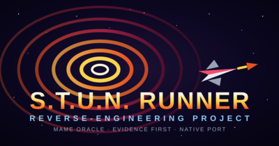
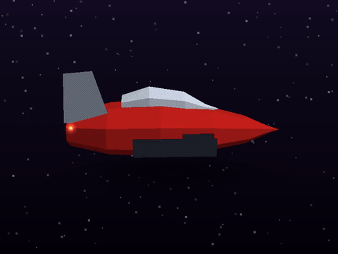

# S.T.U.N. Runner Reverse Engineering Project

Experimental, evidence-driven reconstruction of Atari Games' **S.T.U.N. Runner** using a three-agent workflow: Investigator, Implementer, and Verifier.

The project aims to incrementally produce both a reproduction build for the original/emulated hardware environment and a native Linux port, with MAME execution serving as the behavioral reference.

See `PROCESS.md` for the workflow and `PROJECT.md` / `STATUS.md` / `MILESTONES.md` for current project state.

## Promo kit

Watch the [sizzle reel](promo/sizzle-reel.mp4) (21 s), check the
[gameplay screenshots](promo/screenshots/), or spin the procedurally
modeled player craft:

All shareable art lives in [`promo/`](promo/) — logo, poster, social
card, wallpaper, sticker, ASCII banner, and the 3D turntable sources.
`promo/FACTS.md` is the one-page hype sheet.
